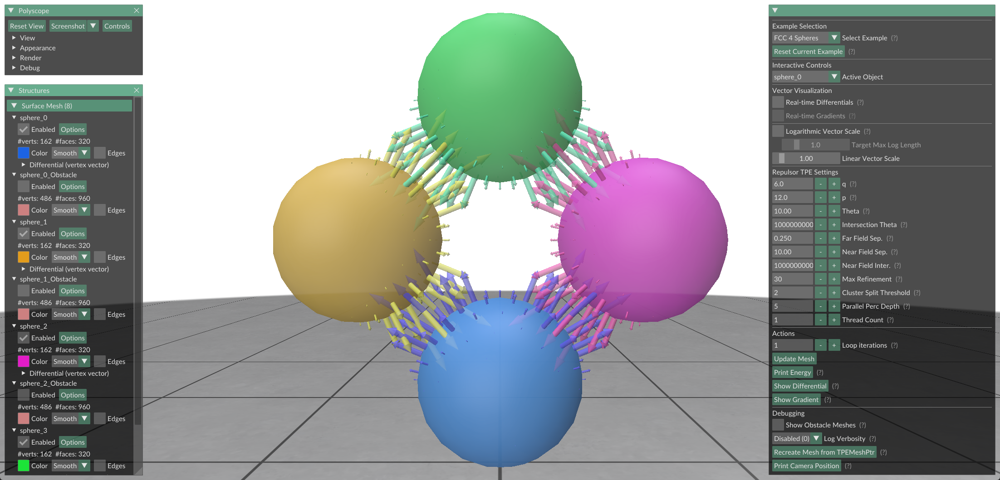

# TPEInteractive: Interactive Tangent Point Energy Explorer

[](https://opensource.org/licenses/MIT)

<p align="center">
  
</p>

TPEInteractive is a C++/OpenGL application demonstrating the calculation and interaction with Tangent Point Energy (TPE) between surfaces, leveraging the [Repulsor](https://github.com/HenrikSchumacher/Repulsor/) library and visualized using [Polyscope](https://polyscope.run/).

This tool allows users to:

*   Load different mesh example scenes (e.g., multiple spheres).
*   Interactively manipulate meshes using a 3D gizmo.
*   Calculate and visualize TPE differentials and gradients in real-time or on demand.
*   Observe the effects of TPE forces by applying gradient descent steps ("Update Mesh").
*   Experiment with various Repulsor TPE parameters.

## Table of Contents

*   [Features](#features)
*   [Getting Started](#getting-started)
    *   [Prerequisites](#prerequisites)
    *   [Building](#building)
    *   [Running](#running)
*   [Usage Guide](#usage-guide)
*   [Development](#development)
*   [Contributing](#contributing)
*   [License](#license)
*   [Acknowledgements](#acknowledgements)

## Features

*   **Interactive Mesh Manipulation:** Drag and rotate meshes using Polyscope's gizmo.
*   **Tangent Point Energy:** Utilizes the Repulsor library for accurate TPE calculations.
*   **Vector Visualization:** Displays differential and gradient vectors on mesh vertices.
*   **Configurable Parameters:** Adjust TPE exponents (p, q) and Repulsor tree settings via the UI.
*   **Multiple Examples:** Includes pre-defined scenes like FCC sphere lattices and two-sphere interactions.
*   **Cross-Platform (Experimental):** CMake build system setup for Windows (clang-cl) and Linux (GCC/Clang). (*Linux Build untested*)
*   **Multiple BLAS Backends:** Supports Intel MKL and OpenBLAS for optimized linear algebra. (Add others if supported).

&nbsp;
<p align="center">
  
</p>

## Getting Started

### Prerequisites

Before building TPEInteractive, you need the following installed:

1.  **CMake:** Version 3.21 or higher. ([Download CMake](https://cmake.org/download/))
2.  **C++ Compiler:** A C++20 compatible compiler:
    *   **Windows:** Clang (clang-cl) 19+. Download the latest clang-cl [here](https://github.com/llvm/llvm-project/releases).
    *   **Linux:** GCC (g++) version 13+ or Clang version 12+.
3.  **Ninja (Recommended):** For faster builds, especially with multi-config generators. ([Download Ninja](https://github.com/ninja-build/ninja/releases))
4.  **BLAS/LAPACK Backend:** Either Intel MKL or OpenBLAS.

Detailed build instructions for different platforms and backends can be found in [**docs/BUILDING.md**](./docs/BUILDING.md).

A typical build sequence looks like this:

```bash
# 1. Clone the repository (including submodules)
git clone --recursive https://your-repo-url/TPEInteractive.git
cd TPEInteractive

# 2. Configure using CMake Presets (Recommended)
#    Choose a preset name from CMakePresets.json (e.g., native-windows-MKL)
#    Make sure to provide the correct paths before attempting to configure.
cmake --preset <your-chosen-preset-name> # Example: cmake --preset native-windows-MKL

# (Optional) Configure manually if not using presets:
# cmake -S . -B build -G Ninja -DCMAKE_BUILD_TYPE=Release -DTPE_BLAS_LAPACK_BACKEND=MKL -DMKL_DIR=/path/to/mkl

# 3. Build
cmake --build build --config Release # Or Debug

# 4. (Optional) Install (Copies executable and runtime DLLs)
#    The install prefix is defined in CMakePresets.json or via -DCMAKE_INSTALL_PREFIX
cmake --install build --prefix ./dist --config Release
```

### Running

- From Build Directory: If you didn't run the install step, you might need to adjust your system's `PATH` environment variable to include the directories containing the required DLLs (MKL, OpenBLAS, GLFW, etc.) before running `build/Release/TPEInteractiveApp.exe`.

- From Install Directory (Recommended): If you ran `cmake --install`, navigate to the installation directory (`./dist/bin` in the example above) and run the executable directly:

```bash
cd dist/bin
./TPEInteractiveApp # Linux/macOS
.\TPEInteractiveApp.exe # Windows
```

All necessary runtime DLLs should have been copied here by the install step.

### Usage Guide

For instructions on how to use the application interface, manipulate meshes, and interpret the visualizations, please refer to the [Usage Guide](docs/USAGE.md).

### Development

Information for developers looking to modify or extend TPEInteractive can be found in the [Development Guide](docs/DEVELOPMENT.md). This includes details on the code structure and key components.

### Contributing

Contributions are welcome! Please read the [Contributing Guidelines](CONTRIBUTING.md) for details on reporting bugs, requesting features, and submitting pull requests.

You can also check the [GitHub Issues](https://github.com/hollowsunhc/TPEInteractive/issues) tab.

### License

This project is licensed under the [MIT License] - see the [LICENSE](LICENSE.md) file for details.

### Acknowledgements

- [Polyscope](https://github.com/nmwsharp/polyscope) for the visualization library.
- [Repulsor](https://github.com/HenrikSchumacher/Repulsor) library for the TPE computations.
- [Intel oneMKL](https://www.intel.com/content/www/us/en/developer/tools/oneapi/onemkl.html#gs.laz8kj) / [OpenBLAS](https://github.com/OpenMathLib/OpenBLAS) for high-performance linear algebra.
- GLM library (via Polyscope).
- GLFW and ImGui (via Polyscope).
