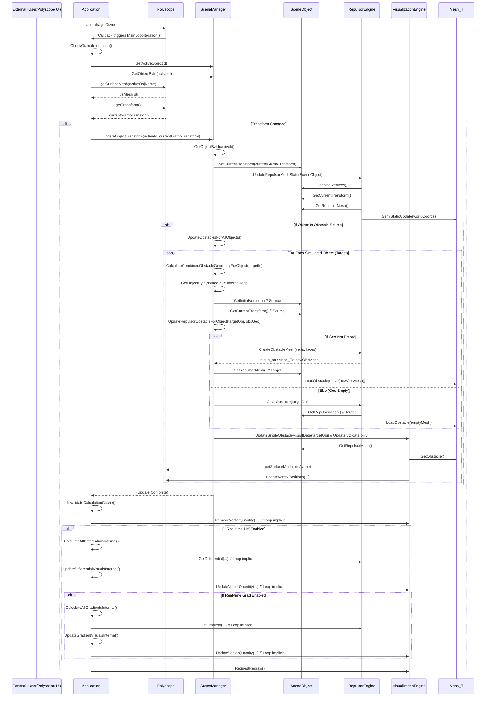
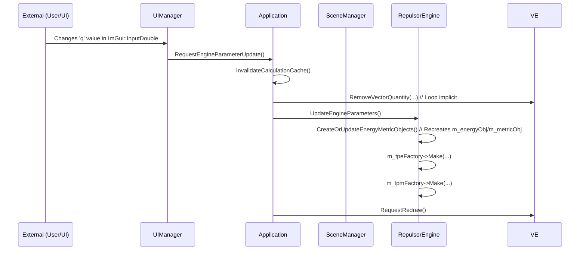

# TPEInteractive Development Guide

This document provides information for developers interested in understanding, modifying, or extending the TPEInteractive codebase.

## Code Structure Overview

The project follows a modular structure located primarily within the `src/` directory:

*   **`main.cpp`:** Entry point, creates and runs the `Application` instance.
*   **`Application/`:** Contains the main `Application` class responsible for initializing systems, managing the main loop, handling UI requests, and coordinating other components.
*   **`Scene/`:** Manages the representation and state of the 3D scene.
    *   `SceneManager`: Owns and manages the collection of `SceneObject`s, handles loading/unloading based on `SceneDefinition`, orchestrates updates (gizmo, physics), calculates and updates obstacles.
    *   `SceneObject`: Represents a single entity in the scene (e.g., a sphere). Holds its definition, runtime state (transform, base vertices), and potentially its Repulsor mesh object (`Mesh_T`).
*   **`Engine/`:** Wrappers around core libraries.
    *   `RepulsorEngine`: Interfaces with the Repulsor library. Handles `Mesh_T` creation, updates (`SemiStaticUpdate`), obstacle loading (`LoadObstacle`), energy/gradient calculations, and parameter application.
    *   `VisualizationEngine`: Interfaces with the Polyscope library. Handles registration/removal of meshes and vector quantities, updates transforms and vertex positions, manages gizmo state, and controls camera settings.
*   **`UI/`:** User interface logic.
    *   `UIManager`: Responsible for drawing the ImGui interface using data queried from `SceneManager` and `Config`, and for signaling actions back to the `Application`.
*   **`Examples/`:** Code for defining and loading specific example scenes.
    *   `ExampleLoader`: Contains static methods to create `SceneDefinition` structs for different examples.
    *   `EmbeddedMeshData.h`: (Optional/Recommended) Stores static vertex/face data for built-in examples.
    *   `FCCLatticeSpheres.h`: Example helper function.
*   **`Data/`:** Plain data structures.
    *   `SceneDefinition.h`: Defines the static layout and properties of a scene and its objects.
    *   `MeshData.h`: Basic vertex/face data storage.
*   **`Config/`:**
    *   `Config.h`: Defines the `ConfigType` struct holding all configurable application settings.
*   **`Utils/`:** General utility functions and type definitions.
    *   `GlobalTypes.h`: Common type aliases (`Real`, `Int`, `Mesh_T`, etc.).
    *   `BLASLAPACK_Types.h`: Backend-specific type definitions based on CMake configuration.
    *   `Helpers.h/.cpp`: Math functions, tensor conversions, UI helpers, etc.

## Key Data Flow

### Application Initialization and Scene Loading

```mermaid
sequenceDiagram
    participant M as main()
    participant APP as Application
    participant RE as RepulsorEngine
    participant VE as VisualizationEngine
    participant SM as SceneManager
    participant UI as UIManager
    participant EL as ExampleLoader
    participant SO as SceneObject
    participant PS as Polyscope

    M->>+APP: Create Application
    APP->>APP: Initialize()
    APP->>PS: init()
    APP->>+RE: Create RepulsorEngine
    APP->>+VE: Create VisualizationEngine
    APP->>+SM: Create SceneManager(RE, VE, Config)
    APP->>+UI: Create UIManager(Config, SM, APP)
    APP->>APP: SetupPolyscope()
    APP->>PS: state::userCallback = PolyscopeCallback
    APP->>APP: LoadInitialScene()
    APP->>APP: RequestExampleLoad(defaultExampleId)
    APP->>VE: RemoveAllObjects()
    APP->>+EL: LoadExample(defaultExampleId)
    EL-->>APP: SceneDefinition  # Keep APP active
    APP->>VE: SetCameraView(...)
    APP->>+SM: LoadScene(SceneDefinition)
    SM->>SM: Create SceneObjects loop
    loop For each Object Definition
        SM->>+SO: Create SceneObject(objDef)
        opt If Simulated # Use opt instead of alt if it's optional
            SM->>RE: InitializeRepulsorMesh(SceneObject)
            RE->>SO: SetRepulsorMesh(unique_ptr<Mesh_T>)
            RE->>RE: UpdateRepulsorMeshState(SceneObject)
            RE->>SO: GetInitialVertices()
            RE->>SO: GetCurrentTransform()
            RE->>SO: GetRepulsorMesh()
            # Assuming Mesh_T interactions don't need explicit activation/deactivation
            RE->>Mesh_T: SemiStaticUpdate(worldCoords)
        end
        SM->>VE: RegisterObject(SceneObject)
        VE->>SO: GetUniqueName()
        VE->>SO: GetInitialVertices()
        VE->>SO: GetSimplices()
        VE->>PS: registerSurfaceMesh(...)
        VE->>PS: setTransform(...)
        SO-->>-SM: (SceneObject created) # Deactivate SO
    end
    SM->>SM: UpdateObstaclesForAllObjects()
    loop For each Simulated Object
        SM->>SM: CalculateCombinedObstacleGeometryForObject(objId)
        SM->>SM: GetObjectById(sourceId) # Internal loop
        SM->>SO: GetInitialVertices() // Source
        SM->>SO: GetCurrentTransform() // Source
        SM->>SM: UpdateRepulsorObstacleForObject(targetObj, obsGeo)
        alt If Geo Not Empty
            SM->>RE: CreateObstacleMesh(verts, faces)
            RE-->>SM: unique_ptr<Mesh_T>
            SM->>SO: GetRepulsorMesh() // Target
            SM->>Mesh_T: LoadObstacle(move(unique_ptr<Mesh_T>))
        else Else (Geo Empty)
            SM->>RE: ClearObstacle(targetObj)
            RE->>SO: GetRepulsorMesh() // Target
            RE->>Mesh_T: LoadObstacle(emptyMesh) // Internal engine logic
        end
        SM->>VE: RegisterOrUpdateObstacleVisuals(targetObj) # Update viz
    end
    SM->>SM: Set initial active object ID
    SM->>VE: UpdateActiveGizmo("", activeName)
    VE->>PS: getSurfaceMesh(activeName)
    VE->>PS: setTransformGizmoEnabled(true)
    SM-->>APP: bool loaded # Keep APP active
    deactivate SM # Deactivate SM after LoadScene finishes
    # Deactivate engines and UI after setup if no longer directly involved
    deactivate RE
    deactivate VE
    deactivate UI
    M->>APP: Run()
    APP->>PS: show()
```

### Gizmo Move Interaction



### UI Interaction (Example: Changing parameter 'q')




## Adding a New Example

1.  Add a new identifier to the `ExampleId` enum in `src/Data/SceneDefinition.h`.
2.  Create a new static private method in `ExampleLoader` (e.g., `CreateMyNewScene()`) that returns a `SceneDefinition`.
    *   Define `SceneObjectDefinition`s for each object.
    *   Create or load `MeshData` (using `EmbeddedMeshData.h` or file loading) and assign it via `std::make_shared`. Remember that `SceneObject` makes a *copy* of vertices for its `m_initialVertices`, so the shared pointer is mainly for topology (`simplices`).
    *   Set properties (`isSimulated`, `isInteractive`, `isObstacleSource`, `obstacleDefinitionIds`).
    *   Set scene camera defaults (`upDir`, `initialCameraPosition`, etc.).
3.  Add a `case` for your new `ExampleId` in `ExampleLoader::LoadExample` that calls your new creation method.
4.  Add an entry for the new example to `UIManager::m_exampleDisplayNames`.

## Modifying Physics

*   The core physics step logic is in `SceneManager::ApplyPhysicsStep` and `RepulsorEngine::CalculateWorldDisplacement`.
*   Energy and metric types are defined in `GlobalTypes.h` and created in `RepulsorEngine`. You could modify the template arguments or use different Repulsor factories here.
*   The calculation of the step (`t`) and the update rule (`next_world = current_world + X_update`) are within `RepulsorEngine::CalculateWorldDisplacement`.

## Build System (CMake)

*   See `CMakeLists.txt` and `docs/BUILDING.md`.
*   Dependencies are primarily managed in the root `CMakeLists.txt`.
*   Select the BLAS/LAPACK backend using the `TPE_BLAS_LAPACK_BACKEND` CMake cache variable.

Remember to keep components decoupled where possible and follow consistent naming conventions.
