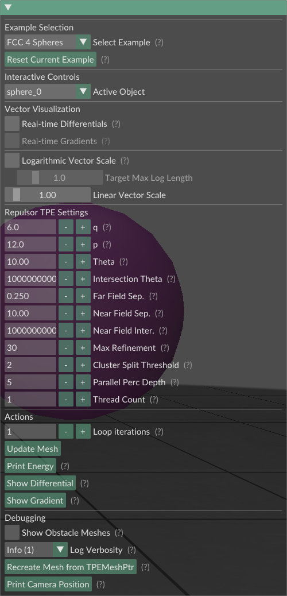
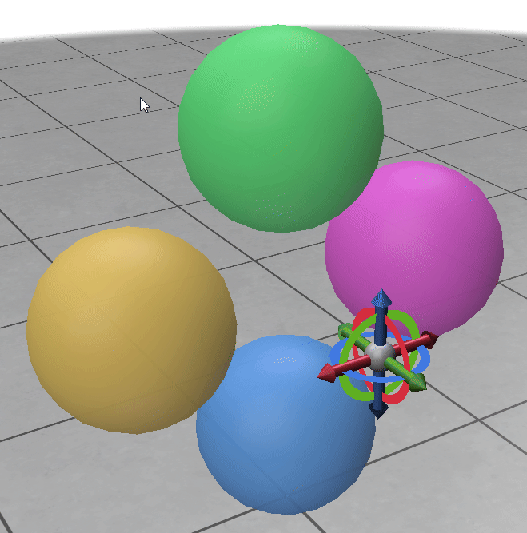

# TPEInteractive Usage Guide

This guide explains how to use the TPEInteractive application interface.

  

## UI Panel Sections

### 1. Example Selection

*   **Select Example:** Dropdown menu to load different pre-defined scenes (e.g., "FCC 4 Spheres", "Two Spheres"). Loading a new example clears the current state.
*   **Reset Current Example:** Reloads the currently selected example from its initial state.

### 2. Interactive Controls

*   **Active Object:** Dropdown menu listing all *interactive* objects in the scene. Select an object here to enable its transformation gizmo.
*   **Transformation Gizmo:** When an object is active, a 3D gizmo appears attached to it.
    *   Click and drag the **arrows** to translate the object along the X, Y, or Z axes.
    *   Click and drag the **arcs** to rotate the object around the axes.
    *   Click and drag the **sphere** to scale the object.
    
&nbsp;

  

### 3. Vector Visualization

Controls how energy differential and gradient vectors are displayed on the mesh vertices.

*   **Real-time Differentials:** If checked, the differential vectors are recalculated and displayed continuously while dragging the gizmo.
*   **Real-time Gradients:** If checked (requires Real-time Differentials to also be checked), the gradient vectors are also recalculated and displayed continuously while dragging.
*   **Logarithmic Vector Scale:** Toggles between linear and logarithmic scaling for vector lengths. Log scaling makes smaller vectors more visible relative to larger ones.
*   **Target Max Log Length:** (Only active if Logarithmic scale is checked) Controls the maximum length displayed vectors will have when using log scaling. Adjust this to fit the visual scale.
*   **Linear Vector Scale:** (Only active if Logarithmic scale is *un*checked) A multiplier applied to the raw vector lengths for display. Adjust this if vectors are too small or too large.

### 4. Repulsor TPE Settings

Adjust parameters used by the underlying Repulsor library. Changes here affect subsequent energy/gradient calculations and physics steps.

*   **q / p:** Exponents used in the Tangent Point Energy formulation.
*   **Theta / Intersection Theta:** Adaptivity parameters controlling the accuracy/speed trade-off for far-field approximations and intersection checks in the Hierarchical ACA used by Repulsor. Smaller values are more accurate but slower.
*   **Max Refinement:** Maximum depth the adaptive algorithm will refine spatial subdivisions.
*   **Cluster Tree Settings:** Parameters controlling how the geometry is initially partitioned (Split Threshold, Parallel Percolation Depth).
*   **Block Cluster Tree Settings:** Parameters controlling how interactions between different parts of the geometry (or between object and obstacle) are classified (Far/Near Field Separation/Intersection).

*(Consult Repulsor library documentation for more details).*

### 5. Actions

Perform calculations and simulations.

*   **Loop iterations:** Sets how many physics steps are performed when "Update Mesh" is clicked.
*   **Update Mesh:** Calculates the current TPE gradient for each simulated object and takes a small step in the negative gradient direction to simulate the forces. Repeats for the specified number of iterations.
*   **Print Energy:** Outputs the current TPE value for each simulated object to the console where the application was launched.
*   **Show Differential:** Calculates and displays the TPE differential vectors (dE/dx) on all simulated meshes.
*   **Show Gradient:** Calculates and displays the TPE gradient vectors (inv(Metric) * dE/dx) on all simulated meshes. Requires a valid differential calculation first.

### 6. Debugging & Visualization

*   **Recreate Mesh from TPEMeshPtr:** Creates a new, temporary Polyscope mesh showing the *exact* vertex positions currently stored within the selected object's internal Repulsor `Mesh_T` object. Useful for verifying that Repulsor's state matches the visualization.
*   **Show Obstacle Meshes:** Toggles the visibility of the computed obstacle meshes used by Repulsor. When enabled, a semi-transparent mesh representing the obstacle for each simulated object will be displayed. Users can manually disable individual obstacle visuals in the Polyscope structure list. This checkbox controls the default/overall visibility.
*   **Log Verbosity:** Controls the level of detail printed to the console by Polyscope and potentially the application itself (0=Silent, 1=Info, 2=Debug).
*   **Print Camera Position:** Prints the actual position of the camera. Useful when integrating new examples.